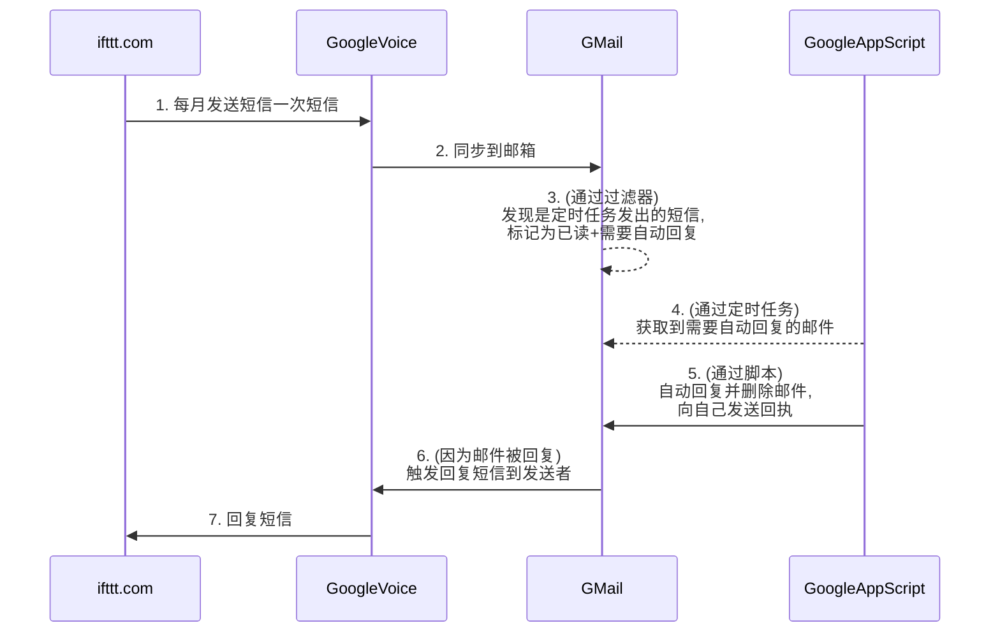

GoogleVoice自动保号
==================


需要注册 [ifttt.com](ifttt.com), 剩下的全部都由Google的设定完成, 只能对+1手机号进行自动保号.

以下是主要流程



# 0. 注册ifttt.com

自行注册

# 1. 使得ifftt.com自动发送短信

- 进入 [keep-google-voice-active-send-messege](https://ifttt.com/applets/SsnxTYZJ-keep-google-voice-active-send-messege) ,
  滑动滑块, 接受短信, 验证后PIN后再次进入, 已经变成了Connected

- 点击右上角的 Settings 字样, 编辑if设置时间为自己想发送的日期, 再次编辑 then 设置发送内容 为 **KeepGV** (这里随意, 只是为了让Gmail根据内容识别), 最后点击Update更新,
  这样再每月你设定的日期会发送一条短信到你的手机号了

# 2. 让短信同步到邮箱

进入 [GoogleVoice的设置](https://voice.google.com/u/0/settings#donotdisturb)  (注意这里的链接是第一个号码的设置, 多个的话您需要自行寻找), 将 **
将短信转发到电子邮件地址** 设置为开启状态

# 3. Gmail邮件自动分类

- 登录Gmail

- 新建标签 KeepGV
- 在最上面类似搜索框的内容中, 新建过滤器。 匹配来自 @txt.voice.google.com 且内容包含 KeepGV 的邮件。 将其 跳过收件箱直接归档, 并应用 KeepGV 标签, 自动标记为已读, 且不要扔进垃圾邮件。

# 4. 5. GoogleApp定时脚本

- 登录 [Google Drive](https://drive.google.com/drive/my-drive) 并点击左上角的新建。创建一个新的 Google App 脚本（如果您没有 Google App Script，请点击
  Link More Apps，然后添加 Google App Script）。这样就新建了一个脚本项目。

- 脚本内容

  ```javascript
  // 注意要将其中日志的email地址换掉
  
  function autoReplier() {
  
      // 获取标签
      var labelObj = GmailApp.getUserLabelByName('KeepGV');
  
      try {
          // 获取标签中的threads, 最多也只获取前20个
          for (var gg = 0; gg < labelObj.getThreads().length && gg < 20; gg++) {
              var gmailThreads = labelObj.getThreads()[gg];
              // 获取thread中的messages, 最多也只获取前20个
              var messages = gmailThreads.getMessages();
              for (var ii = 0; ii < messages.length && ii < 20; ii++) {
                      // 随机回复并删除
                      var sender = messages[ii].getFrom();
                      array = [
                        ["最灵繁的人也看不见自己的背脊。——非洲"],
                        ["最困难的事情就是认识自己。——希腊"],
                        ["有勇气承担命运这才是英雄好汉。——黑塞"],
                        ["阅读使人充实，会谈使人敏捷，写作使人精确。——培根"],
                        ["自知之明是最难得的知识。——西班牙"],
                        ["有时候读书是一种巧妙地避开思考的方法。——赫尔普斯"],
                        ["越是无能的人，越喜欢挑剔别人的错儿。——爱尔兰"],
                        ["一个人即使已登上顶峰，也仍要自强不息。——罗素·贝克"],
                        ["最大的挑战和突破在于用人，而用人最大的突破在于信任人。——马云"]
                      ];
                      var j = Math.floor(Math.random() * (array.length));
                      var temp = array[j];
                      MailApp.sendEmail(sender, "Auto Reply", temp);
                      messages[ii].markRead();
                      messages[ii].moveToTrash();
                      // GmailApp.sendEmail("xxxx@gmail.com", "KeepGV task completed", "KeepGV task completed");
                      break;
              }
          }
      } catch (err) {
          // 随机回复记录日志
          console.error('for loop error: ' + err);
          GmailApp.sendEmail("xxxx@gmail.com", "KeepGV task fail", 'for loop error: ' + err);
      }
  }
  
  ```


- 点击左边的小闹钟, 设置一个每天一次的触发器, 时间驱动, 每天一次

# 6. 7. 将会自动触发

在手机端可以进行测试

# 8. 如果你喜欢可以两个号码互相保号


