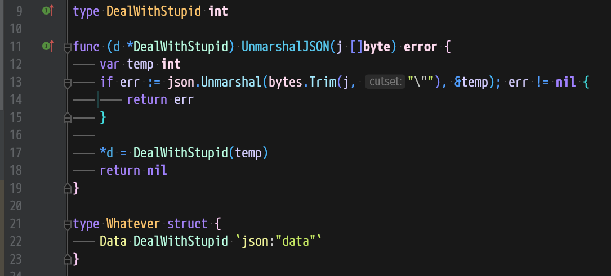
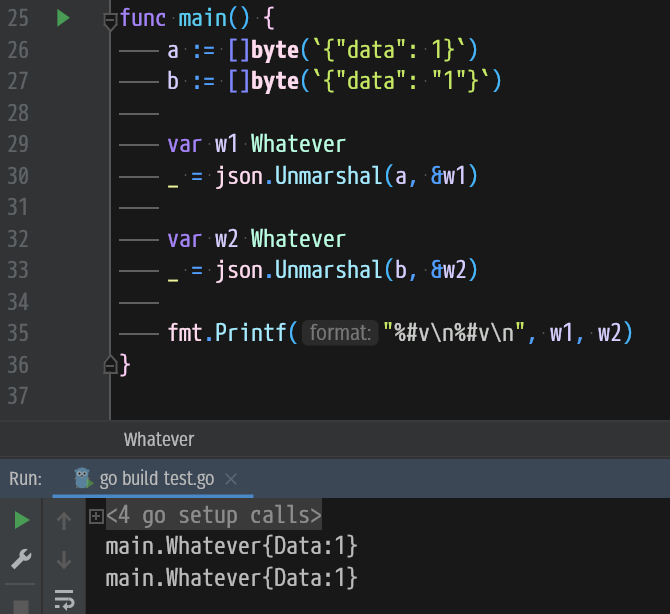

### 方法1

```go
import (
	"fmt"
	jsoniter "github.com/json-iterator/go"
	"github.com/json-iterator/go/extra"
)

var json jsoniter.API

func init() {
	extra.RegisterFuzzyDecoders()
	json = jsoniter.ConfigCompatibleWithStandardLibrary
}

// 像往常一样使用json
```

### 方法2

```go
import (
	"fmt"
	jsoniter "github.com/json-iterator/go"
	"github.com/json-iterator/go/extra"
)

type A struct {
	A int `json:"a"`
}

func main() {
	extra.RegisterFuzzyDecoders()
	str := `{"a": "10"}`
	var a A
	err := jsoniter.Unmarshal([]byte(str), &a)
	if err != nil {
		panic(err)
	}
	fmt.Printf("%+v\n", a)
}
```

### 方法3 (自定义解析)







