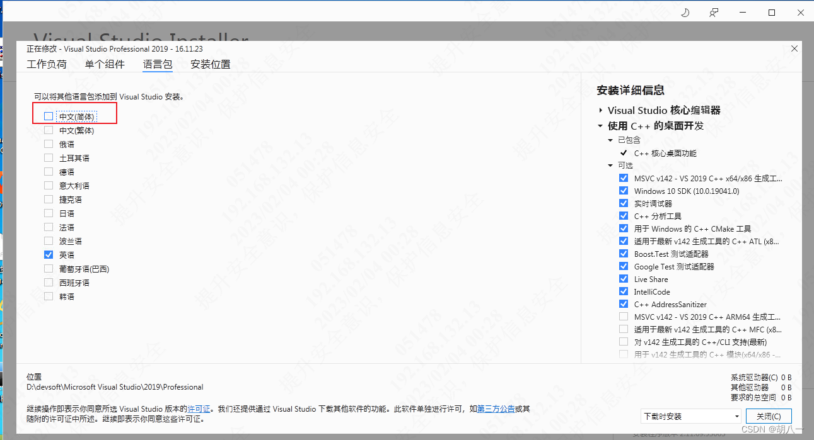

# Graalvm

## 生配置文件

https://www.graalvm.org/latest/reference-manual/native-image/metadata/AutomaticMetadataCollection/

运行单元测试或应用程序生成配置文件

```groovy
tasks.register('mergeNativeConfigs', JavaExec) {
    dependsOn 'classes'
    mainClass = 'niuhuan.demo.DemoApplicationKt'
    classpath = sourceSets.main.runtimeClasspath
    jvmArgs("-agentlib:native-image-agent=config-out-dir=src/main/resources/META-INF/native-image/niuhuan/demo")
}
```

如果不能运行完整的配置，可将`config-out-dir`更换为`config-merge-dir`进行合并操作

## 提示

### 解决Windows平台JDK20打包出错

##### 错误内容
`Native-image building on Windows currently only supports target architecture: AMD64 (?? unsupported)`

##### 修复方案

摘抄自： https://blog.csdn.net/qq_44732146/article/details/128877947

开始菜单 => Visual Studio Installer => 修改生成工具 => 语言包勾选英文，去掉中文。



