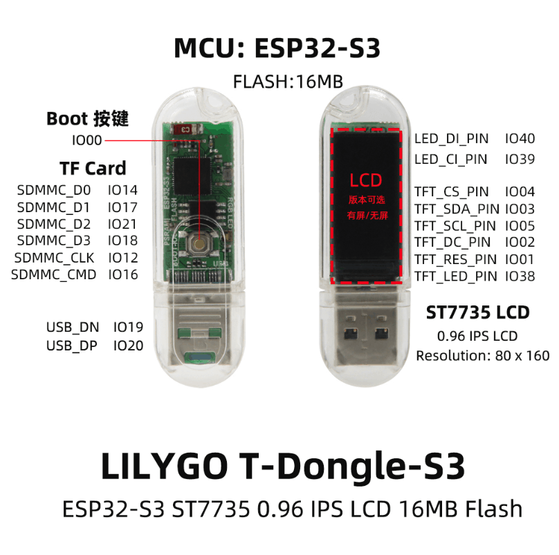
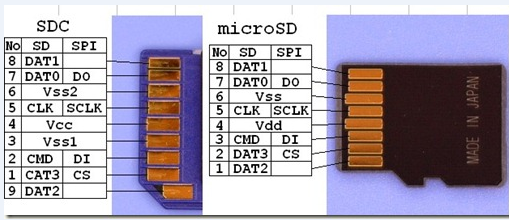

Micropython
===========

**代码以此开发板为例**



## wlan 和 SD



[代码](sources)

## 解决MIP因网络问题无法使用

1. 找到[MIP的源代码](https://github.com/micropython/micropython-lib/blob/98f8a7e77181d9558c0080e6a6c9cf920503e4a3/micropython/mip/mip/__init__.py) ，下载到开发板，另存 `local_mip.py`
2. `_rewrite_url` 加入 `ghproxy` (https://mirror.ghproxy.com/)
3. ```
     import local_mip
     local_mip.install("github:peterhinch/micropython-mqtt")
   ```

## mqtt

https://github.com/mochi-mqtt/server/blob/main/README-CN.md
