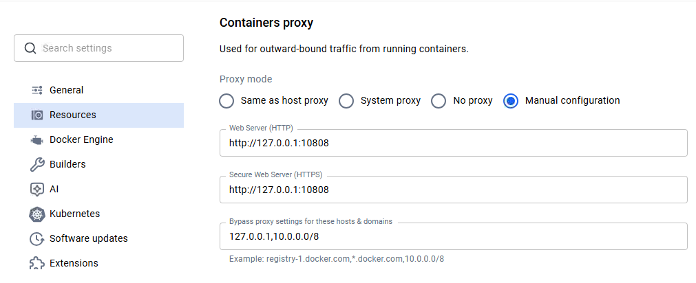
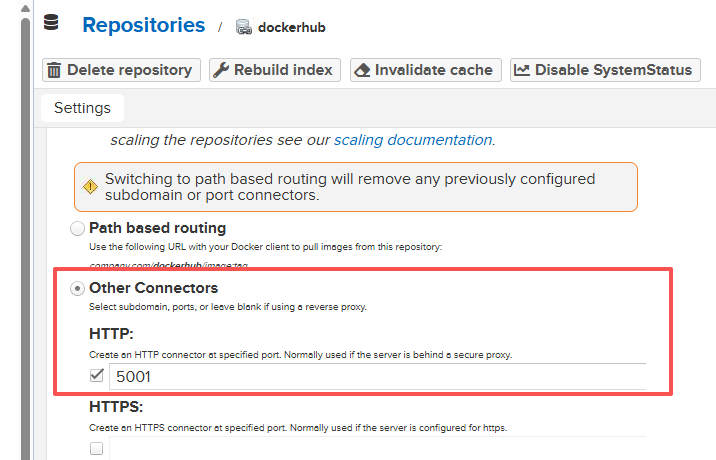
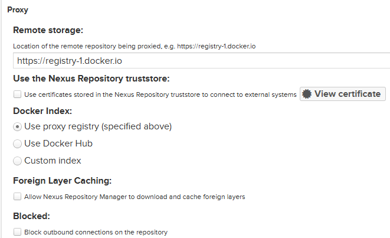

## 安装 docker desktop 

## 设置容器代理 (可选, 拉取镜像以及镜像内会走此代理)



## 启动nexus

```yaml
services:
  nexus:
    image: sonatype/nexus3:latest
    container_name: nexus
    restart: unless-stopped
    ports:
      - "8081:8081"   # Nexus Web UI
      - "5000:5000"   # 例：docker-hosted
      - "5001:5001"   # 例：docker-proxy (mirror)
      - "5002:5002"   # 例：docker-group (统一入口)
    volumes:
      - ./nexus-data:/nexus-data
```

## 新建镜像

### 设置HTTP端口



### 如果局域网内使用, 可以设置匿名访问

### 代理官方地址

https://registry-1.docker.io




### 

```json
{
  "builder": {
    "gc": {
      "defaultKeepStorage": "20GB",
      "enabled": true
    }
  },
  "experimental": false,
  "log-driver": "json-file",
  "log-opts": {
    "max-file": "3",
    "max-size": "256k"
  },
  "insecure-registries": [
    "localhost:5001"
  ],
  "registry-mirrors": [
    "http://localhost:5001"
  ]
}
```