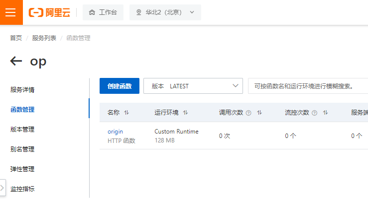
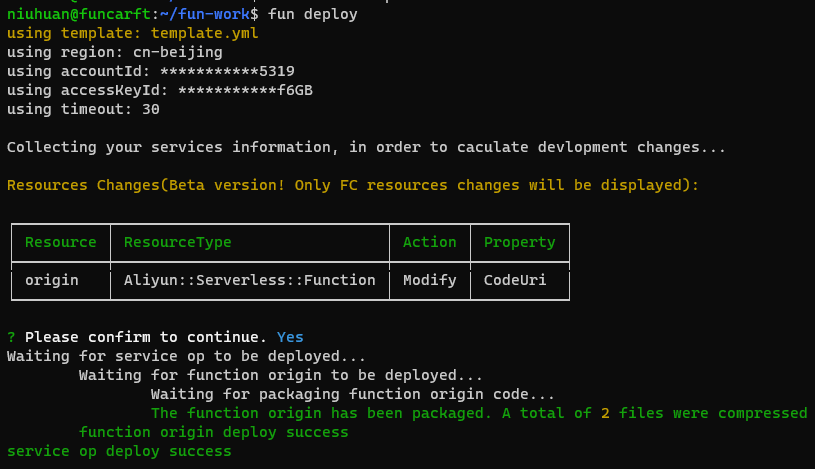

阿里云 - 函数计算 - 自定义函数
==========================

# 账户

## 获取账户AccessKey

https://help.aliyun.com/document_detail/38738.html

## 创建一个函数

创建一个服务以及一个函数

这里创建的服务叫op, 函数叫origin



# 使用 Serverless Devs

参考 https://help.aliyun.com/document_detail/295897.htm?spm=a2c4g.11186623.0.0.1c9a3378pbB5PU#task-2099648

```shell
sudo npm install @serverless-devs/s -g  
```

# 使用 fcli (过时)

参考 https://help.aliyun.com/document_detail/52995.html

```shell
wget https://gosspublic.alicdn.com/fcli/fcli-v1.0.4-linux-amd64.zip
unzip fcli-v1.0.4-linux-amd64.zip
mv fcli /usr/bin/
```

```shell
fcli config
```

# 使用funcraft管理函数 (过时)

参考 https://help.aliyun.com/document_detail/155100.html

## 下载 funcraft

根据参考文章给出的地址, 根据操操作系统给出的GitHub链接, 下载fun并放入PATH
```shell
# run with su
wget https://funcraft-release.oss-cn-hangzhou.aliyuncs.com/fun/fun-v3.6.24-linux.zip
unzip fun-v3.6.24-linux.zip
mv fun-v3.6.24-linux /usr/bin/fun
```

## 初始化fun

执行 fun config 并填入认证信息

## 创建一个文件夹

创建一个叫template.yml的文件

模版
```yaml
ROSTemplateFormatVersion: '2015-09-01'
Transform: 'Aliyun::Serverless-2018-04-03'
Resources:
  MyService: # service name
    Type: 'Aliyun::Serverless::Service'
    Properties:
      Policies:
        - AliyunFCReadOnlyAccess # Managed Policy
        - Version: '1' # Policy Document
          Statement:
            - Effect: Allow
              Action:
                - oss:GetObject
                - oss:GetObjectACL
              Resource: '*'
    MyFunction: # function name
      Type: 'Aliyun::Serverless::Function'
      Properties:
        Handler: index.handler
        Runtime: nodejs6
        CodeUri: './'
      Events:
        http-test: # trigger name
          Type: HTTP # http trigger
          Properties:
              AuthType: ANONYMOUS
              Methods: ['GET', 'POST', 'PUT']
```

修改后 (部署op服务的origin函数, 设置环境为自定义环境)
```yaml
ROSTemplateFormatVersion: '2015-09-01'
Transform: 'Aliyun::Serverless-2018-04-03'
Resources:
  op:
    Type: 'Aliyun::Serverless::Service'
    origin:
      Type: 'Aliyun::Serverless::Function'
      Properties:
        Handler: index.handler
        Runtime: custom
        CodeUri: './'
```

## 部署

- 阿里云的说明
  ```text
  Custom Runtime本质上是自定义运行时，您只需创建一个启动目标服务（默认端口为9000的HTTP Server）的可执行文件bootstrap，然后将该文件和您的代码文件一起打成ZIP包，最后以该ZIP包作为代码包创建一个Custom Runtime的函数。
  ```

- bootstrap
  放入一个叫bootstrap的二进制文件, 然后运行 fun deploy, 回到阿里云可以尝试执行此函数。

  bootstrap也可以是脚本, 但是需要监听9000端口
  ```shell
  #!/bin/bash
  java -jar a.jar
  ```

- 执行命令
  


